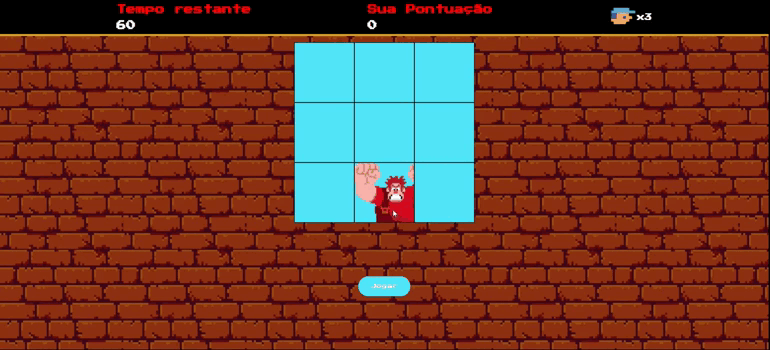

# 🎮 Detona Ralph - Mini Game  

Um jogo simples e divertido inspirado no clássico **Whac-A-Mole**.  
Seu objetivo é **acertar o Ralph** sempre que ele aparecer nas janelas antes que o tempo acabe!  

  

---

## 🚀 Como funciona?  

- Ralph aparece **aleatoriamente** em uma das janelas.  
- Você deve clicar nele para **ganhar pontos**.  
- O tempo começa a **contar regressivamente**.  
- Quando o tempo chegar a zero, o jogo exibe sua pontuação final.  

---

## 📂 Estrutura do Projeto  

```plaintext
📁 detona-ralph
 ┣ 📂 src
 ┃ ┣ 📂 images      # Imagens do jogo (Ralph, player, fundo)
 ┃ ┣ 📂 scripts     # Código JavaScript (main.js)
 ┃ ┗ 📂 styles      # Estilos CSS (reset.css e main.css)
 ┣ 📄 index.html     # Estrutura do jogo
 ┣ 📄 README.md      # Documentação
```


## 🕹️ Como Jogar  

1. Abra o arquivo `index.html` em um navegador.  
2. Clique no botão **🎮 Jogar**.  
3. Ralph começará a aparecer aleatoriamente.  
4. Clique nele o mais rápido possível para **acumular pontos**.  
5. O jogo termina quando o tempo zerar.  

💡 **Dica**: quanto mais rápido você clicar, maior será sua pontuação!  

---

## 🎨 Layout  

- **Painel superior** → mostra tempo, pontos e vidas.  
- **Painel de jogo** → dividido em uma grade 3x3 de janelas.  
- **Botão Jogar** → inicia uma nova partida.  

Exemplo da tela de jogo:  
```plaintext
+------------------------------------------------+
| Tempo restante: 60       Pontos: 0      ❤️ x3  |
+------------------------------------------------+
|   [ ]      [R]      [ ]                        |
|   [ ]      [ ]      [ ]                        |
|   [ ]      [ ]      [ ]                        |
+------------------------------------------------+
|                   [ Jogar ]                    |
+------------------------------------------------+
```

---

## 🛠️ Tecnologias Utilizadas  

- **HTML5** → Estrutura do jogo  
- **CSS3** → Estilização (layout retrô arcade 🎨)  
- **JavaScript (Vanilla)** → Lógica do jogo (movimento do Ralph, timer e pontuação)  

---

## 🔧 Personalização  

Você pode ajustar o jogo facilmente no arquivo **`main.js`**:  

- `gameDuration` → Tempo total da partida (padrão: `60` segundos)  
- `gameVelocity` → Velocidade que o Ralph aparece (padrão: `1000ms`)  

---

## 📸 Preview  


  
---

## 📜 Licença  

Este projeto foi criado apenas para **fins de estudo e diversão**.  
Sinta-se à vontade para modificar e compartilhar 🎉  

---

### 💖 Feito com amor por **João Vitor**  

  
